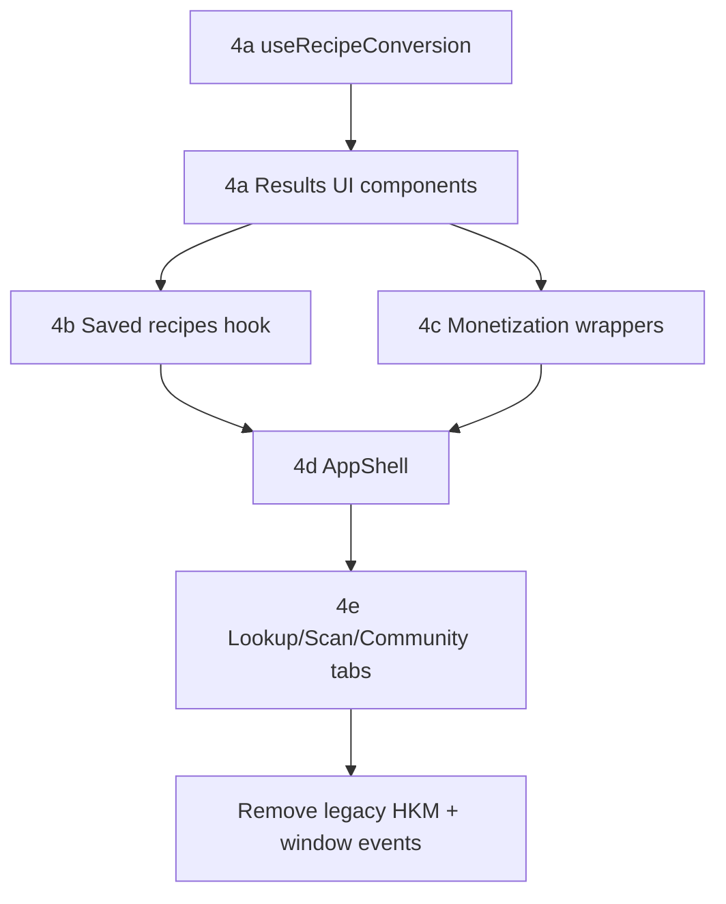

# App.jsx modular decomposition strategy

**Current state:** `frontend/src/App.jsx` (~1,718 lines) is the application shell for `/app` and `/convert`. It owns recipe conversion orchestration, results UI, saved-recipe sidebar, batch convert, tab routing, auth modals, analytics side-effects, and legacy HKM enrichment — while lookup, scan, share cards, and monetization libs already live elsewhere.

**Goal:** Reduce coupling and improve maintainability without a big-bang rewrite.

**Does this preserve the rebuild architecture?** **Yes.** Each module keeps server-authoritative lookup/conversion, shared V1 contracts, and deferred monetization. Decomposition is structural only — no new client verdict paths.

---

## 1. Coupling map (what lives in App today)

| Concern | Lines (approx) | State / handlers | Already extracted |
|---------|----------------|------------------|-------------------|
| **Recipe conversion** | ~350 (`handleConvert`) + ~500 (results UI) | `recipe`, `converted`, `issues`, `confidence`, `error`, accordion | `lib/recipe/*`, `batchConversion.js` |
| **Lookup** | ~20 (bridge only) | — | `QuickLookup`, `useIngredientLookup`, `lib/lookup/*` |
| **OCR / scan** | ~10 (modal toggle) | `showScanModal` | `IngredientScanModal`, `useIngredientScan`, `scanApi` |
| **Sharing** | ~30 + modal props | `showShareHalalModal` | `ShareHalalModal`, `lib/shareCards/*`, `SharePage` |
| **Monetization** | ~200 (issue cards, shop section) | — | `lib/monetization/*`, `ContextualSubstituteRecommendations` |
| **Saved recipes** | ~150 | `savedRecipes`, `viewingRecipe`, save/load/delete | `useSavedRecipes`, `MyHalalRecipesPage`, `saved/*` components |
| **Analytics / limits** | scattered in `handleConvert` | — | `useAnalytics`, `premiumAnalytics`, `subscription` |
| **Auth / social** | ~100 | `user`, modals, `activeTab` feed/profile | `AuthModal`, `SocialFeed`, `CreatePostModal` |
| **Shell / tabs** | ~100 | `activeTab`, window events | `TabNavigation`, `AppRouter` |

**Highest-value extractions:** conversion orchestration + results panel (largest, most coupled).

---

## 2. Logical feature boundaries

Each feature is a **vertical slice**: hook (state + orchestration) → feature component (UI) → existing lib/api.

```
┌─────────────────────────────────────────────────────────────┐
│  AppShell (thin orchestrator, ~150 lines target)            │
│  tabs · auth gate · global modals registry · halalSettings  │
└──────────┬──────────┬──────────┬──────────┬───────────────┘
           │          │          │          │
    ┌──────▼───┐ ┌────▼────┐ ┌───▼───┐ ┌───▼────┐ ...
    │ Convert  │ │ Lookup  │ │ Scan  │ │ Saved  │
    │ Feature  │ │ Feature │ │Feature│ │Recipes │
    └──────────┘ └─────────┘ └───────┘ └────────┘
```

### Boundary rules

1. **Features do not import `halalEngine` / `evaluateItem`** — use server APIs + V1 mappers only.
2. **Confidence is read-only in UI** — display canonical scores (see `CONFIDENCE_STRATEGY.md`).
3. **Monetization loads after core results** — hooks call `enrichConversionAffiliates` / `useDeferredAffiliateLinks`.
4. **Cross-feature communication** uses explicit props/callbacks first; shared context second; `window` events last (migrate away).

---

## 3. Proposed folder structure

```
frontend/src/
├── app/                          # NEW — application shell
│   ├── AppShell.jsx              # replaces bloated App.jsx body
│   ├── AppProviders.jsx          # optional: auth, analytics, halalSettings context
│   ├── useAppTabs.js             # activeTab + tab change + URL sync
│   └── useGlobalModals.js        # auth, scan, share modal open/close
│
├── features/
│   ├── conversion/               # Recipe conversion (primary)
│   │   ├── ConversionTab.jsx   # convert tab layout
│   │   ├── RecipeInputPanel.jsx
│   │   ├── ConversionResultsPanel.jsx
│   │   ├── IngredientIssuesAccordion.jsx   # ~400 lines from App
│   │   ├── BatchConvertSection.jsx
│   │   ├── ConfidenceDisplay.jsx
│   │   ├── useRecipeConversion.js          # handleConvert logic
│   │   ├── useBatchConversion.js
│   │   └── conversion.types.js
│   │
│   ├── lookup/                   # Thin wrapper (logic already in lib/)
│   │   └── LookupBridge.jsx      # onConvertClick → conversion feature
│   │
│   ├── scan/
│   │   └── ScanFeatureGate.jsx   # button + IngredientScanModal wiring
│   │
│   ├── sharing/
│   │   ├── ShareConversionActions.jsx  # copy, download, share buttons
│   │   └── useShareConversion.js
│   │
│   ├── monetization/
│   │   └── ConversionShopSection.jsx   # wraps IngredientShopSection + deferred links
│   │
│   ├── saved-recipes/
│   │   ├── SavedRecipesSidebar.jsx
│   │   ├── SavedRecipeListItem.jsx     # renderRecipeCard
│   │   └── useSavedRecipesInApp.js     # extends useSavedRecipes for App sidebar
│   │
│   ├── analytics/
│   │   └── useConversionAnalytics.js   # trackConversion, limits, feedback
│   │
│   ├── auth/
│   │   └── AuthFeature.jsx             # modal + user state (optional extract)
│   │
│   └── community/                      # feed, create post (lower priority)
│       ├── FeedTab.jsx
│       └── ProfileTab.jsx
│
├── components/                   # KEEP — shared presentational components
├── lib/                          # KEEP — domain logic (no JSX)
├── hooks/                        # KEEP — cross-feature hooks
└── App.jsx                       # SHRINK → re-export AppShell or <AppShell />
```

**CSS strategy:** Co-locate feature CSS as `FeatureName.css` imported by feature components; gradually move rules from `App.css` by selector block (one feature per PR).

---

## 4. Decomposition roadmap

### Phase 4a — Conversion core (highest impact, ~1 week)

| Step | Extract | From App | Risk |
|------|---------|----------|------|
| 4a.1 ✅ | `useRecipeConversion.js` | `handleConvert`, cache, limits | Done — `frontend/src/features/conversion/` |
| 4a.2 | `RecipeInputPanel.jsx` | textarea, errors, example, scan button | Low |
| 4a.3 | `ConversionResultsPanel.jsx` | converted pre, actions row | Low |
| 4a.4 | `IngredientIssuesAccordion.jsx` | issues accordion (~400 lines) | Medium — many props |
| 4a.5 | `ConfidenceDisplay.jsx` | confidence bar + badge | Low |
| 4a.6 | `BatchConvertSection.jsx` | meal plan UI + `handleBatchConvert` | Low |

**Exit criteria:** App.jsx ≤ ~900 lines; conversion E2E unchanged; `npm run build` passes.

### Phase 4b — Saved recipes + sharing (~3–4 days)

| Step | Extract | Notes |
|------|---------|-------|
| 4b.1 | `useSavedRecipesInApp.js` | Replace inline save/load/delete; align with `useSavedRecipes` |
| 4b.2 | `SavedRecipesSidebar.jsx` | `renderRecipeCard`, saved tab list |
| 4b.3 | `ShareConversionActions.jsx` | copy, download, share modals |
| 4b.4 | Wire `MyHalalRecipesPage` patterns | Reuse `SavedRecipeCard` where possible |

### Phase 4c — Monetization isolation (~2 days)

| Step | Extract | Notes |
|------|---------|-------|
| 4c.1 | `ConversionShopSection.jsx` | Filter replaced issues → shop |
| 4c.2 | Move affiliate UI in accordion to `IssueSubstituteLinks.jsx` | Uses `SubstitutePurchaseCard` + deferred links |
| 4c.3 | Remove direct `MAX_LINKS_PER_INGREDIENT` usage from App | Import from monetization feature only |

### Phase 4d — Shell + cross-cutting (~3 days)

| Step | Extract | Notes |
|------|---------|-------|
| 4d.1 | `AppShell.jsx` | Tab switcher, header, footer |
| 4d.2 | `useConversionAnalytics.js` | Analytics + subscription limits from hook |
| 4d.3 | Replace `window` events | `loadRecipe`, `showAuthModal`, `switchTab` → React context or callback registry |
| 4d.4 | Delete legacy HKM block in App | Already dead when `USE_SERVER_RECIPE_CONVERSION`; move to `legacy/` or remove |

### Phase 4e — Lookup / scan / community polish (~2 days)

| Step | Extract | Notes |
|------|---------|-------|
| 4e.1 | `LookupBridge.jsx` | `handleQuickLookupConvert` |
| 4e.2 | `ScanFeatureGate.jsx` | Scan button + modal |
| 4e.3 | `FeedTab.jsx` / `ProfileTab.jsx` | Move tab bodies out of App |

**Target end state:** `App.jsx` ≤ 50 lines (re-export); `AppShell.jsx` ≤ 200 lines.

---

## 5. Migration sequencing (dependency order)



**Do not parallelize** 4a.1 and 4a.4 in the same PR — split orchestration from UI to keep reviews small.

**Recommended PR sizes:** 200–400 line net moves; one feature folder per PR where possible.

---

## 6. Safe refactor strategy

### Strangler pattern (incremental)

1. **Extract hook first, keep JSX in App** — `useRecipeConversion` returns `{ convert, state, actions }`; App calls hook, renders same markup.
2. **Extract presentational component second** — pass hook outputs as props; no new logic in component.
3. **Move JSX third** — delete duplicate from App; import feature component.
4. **Repeat** until App is a composition root only.

### Guardrails per PR

- [ ] No behavior change (same API calls, same feature flags)
- [ ] No new imports of `halalEngine` / `evaluateItem` in features
- [ ] Confidence displayed without UI adjustment (`USE_UI_CONFIDENCE_ADJUSTMENTS: false`)
- [ ] `npm run build` + existing tests pass
- [ ] Manual smoke: convert, lookup, scan, save, share

### Testing strategy

| Layer | Test |
|-------|------|
| Hooks | `useRecipeConversion.test.js` — mock `performCanonicalRecipeConversion` |
| Components | Render tests for `ConfidenceDisplay`, `BatchConvertSection` |
| Integration | Keep existing `test:lookup`, `test:recipe`, `test:confidence` |

### State ownership

| State | Owner after migration |
|-------|----------------------|
| `recipe`, `converted`, `issues`, `confidence` | `useRecipeConversion` |
| `halalSettings` | `AppProviders` context (shared by conversion + lookup bridge) |
| `savedRecipes`, `viewingRecipe` | `useSavedRecipesInApp` |
| Modal booleans | `useGlobalModals` |
| `activeTab` | `useAppTabs` |

### Cross-feature callbacks (replace window events)

```javascript
// features/conversion/LookupBridge.jsx
export function LookupBridge({ onConvertIngredient }) {
  return <QuickLookup onConvertClick={onConvertIngredient} />;
}

// AppShell.jsx
const { convert } = useRecipeConversion({ halalSettings });
<LookupBridge onConvertIngredient={(q) => convert(q, false)} />
```

---

## 7. What stays in App.jsx (final)

```jsx
// App.jsx — target
export { default } from "./app/AppShell.jsx";
```

`AppShell` responsibilities only:

- Compose feature tabs
- Provide `halalSettings` context
- Mount global modals (auth, scan)
- Footer + `TabNavigation`

---

## 8. Anti-patterns to avoid

| Anti-pattern | Why |
|--------------|-----|
| Single `features/index.js` god barrel | Circular imports; use direct imports |
| Shared `useAppState` with 30 fields | Recreates monolith in hook form |
| Moving logic into components | Keep orchestration in hooks, UI in components |
| Big-bang CSS rewrite | Move styles with each feature PR |
| New client conversion path during split | Use existing `lib/recipe/canonicalRecipeConversion` |

---

## 9. Success metrics

| Metric | Now | Target |
|--------|-----|--------|
| `App.jsx` lines | ~1,718 | ≤ 50 (re-export) |
| Largest feature file | — | ≤ 400 lines |
| Direct `halalEngine` imports in app/features | 1 (`App.jsx`) | 0 |
| `window` custom events for app flow | 3 | 0 |

---

## 10. Quick start (first PR)

**PR title:** `refactor: extract useRecipeConversion from App.jsx`

1. Create `features/conversion/useRecipeConversion.js` — move `handleConvert` body verbatim.
2. App calls hook; delete inline function.
3. No JSX changes.
4. Add unit test with mocked API.

**Does this preserve the rebuild architecture?** **Yes.** First PR is a pure extract; server conversion path unchanged.

---

## Related docs

- [PHASE3_RECIPE_CONVERSION.md](./PHASE3_RECIPE_CONVERSION.md)
- [CONFIDENCE_STRATEGY.md](./CONFIDENCE_STRATEGY.md)
- [PHASE1_MIGRATION.md](./PHASE1_MIGRATION.md)
